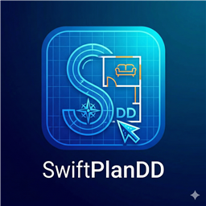

# SwiftPlanDD

SwiftPlanDD is a modern, lightweight, and precise 2D CAD floor planning application designed for architects, interior designers, and DIY enthusiasts. Built with React, Konva, and Electron, it offers a seamless desktop experience for creating professional-grade floorplans.



## Key Features

- **Precision CAD Engine**: Millimeter-accurate modeling with support for architectural map scales (1:20 to 1:500).
- **Intelligent Wall System**: Easily draw and snap walls with customizable thickness and label positioning.
- **Dynamic Openings**: Specialized tools for Doors, Windows, and French Windows with interactive flip and width controls.
- **Fixture Library**: A rich collection of architectural symbols (Beds, Sofas, Baths, etc.) with professional-grade vector representations.
- **Drafting Modes**: Switch between crisp "Classic Light", "Modern Dark", "Blueprint", and hand-drawn "Rough Drafting" styles.
- **Universal Export**: Save projects as `.swift.json` or export your layouts to PNG, PDF, and Draw.io (XML).
- **Intuitive Workflow**: Supports undo/redo, keyboard nudging, and multiple panning methods (Middle-click, Right-click drag, and Spacebar).

## Installation

### Prerequisites
- [Node.js](https://nodejs.org/) (v18 or higher recommended)
- [npm](https://www.npmjs.com/)

### Setup
1. Clone the repository:
   ```bash
   git clone https://github.com/yourusername/SwiftPlanDD.git
   cd SwiftPlanDD
   ```
2. Install dependencies:
   ```bash
   npm install
   ```

## Development

Run the application in development mode with hot-reloading:
```bash
npm run electron:dev
```

## Building for Production

To package the application for Windows:
```bash
npm run electron:build
```
The standalone executable will be generated in the `dist_electron` directory.

## Keyboard Shortcuts

- **Spacebar + Left Click Drag**: Pan Canvas
- **Right Click Drag**: Pan Canvas
- **Middle Mouse Click**: Pan Canvas
- **Scroll Wheel**: Zoom In/Out
- **Arrow Keys**: Nudge Selected Object
- **Shift + Arrow Keys**: Large Nudge
- **Delete / Backspace**: Remove Selected Object
- **Ctrl + Z / Y**: Undo / Redo

## License

Copyright (c) 2026. All rights reserved.
